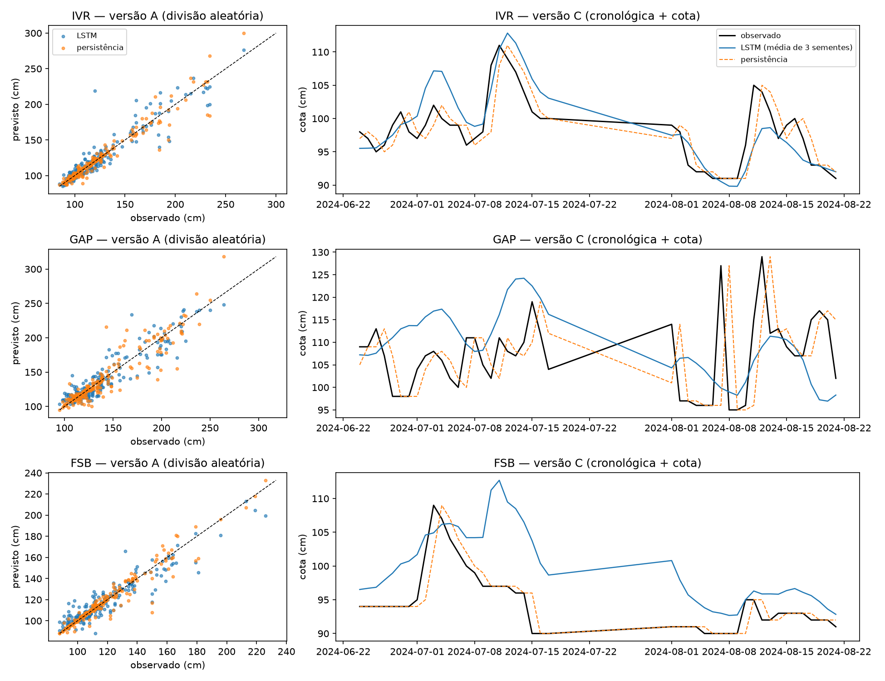
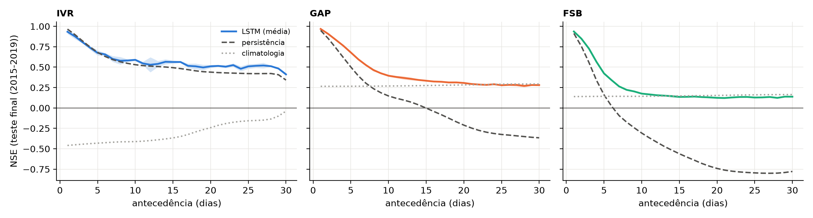
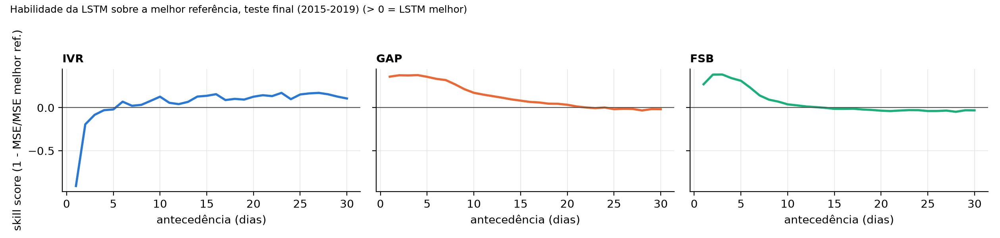

# Previsão de vazão com LSTM na bacia Tietê-Jacaré — Conclusões

**Felipe Inserti**

---

## 1. Resumo

Este trabalho pergunta se uma rede LSTM, treinada para prever vazão diária de 1 a 30 dias à
frente em três postos da bacia Tietê-Jacaré, supera duas referências triviais — persistência
(repetir o valor de ontem) e climatologia (média histórica do dia do ano) — depois de corrigir
os erros metodológicos mais comuns nesse tipo de estudo, em especial o vazamento de dados
entre treino e teste. O método teve duas partes: primeiro, uma reprodução crítica do trabalho
de Zampieri (2025), que mediu o efeito isolado do vazamento e da ausência de referência
trivial; depois, um pipeline próprio, com validação walk-forward (2005-2014), teste trancado e
rodado uma única vez (2015-2019), um modelo fixado a priori (LSTM de 64 unidades + camada
densa de 30 saídas) e decisões de método registradas antes de ver o resultado. A resposta é
que a LSTM supera as duas referências na maior parte do horizonte avaliado, mas com um limite
claro por posto: até o lead 13 em FSB, até o lead 22-24 em GAP e numa faixa mais ampla, porém
menos informativa, em IVR — o posto usado como controle de qualidade de dado, cujo veredito
final depende da métrica de avaliação usada, não de uma conclusão única.

## 2. Introdução

Prever a vazão de um rio com alguns dias ou semanas de antecedência serve para operar
reservatórios, emitir alerta de cheia e planejar outorga de uso da água. O problema fica mais
difícil quanto maior o horizonte: a vazão de hoje carrega informação sobre a vazão de amanhã
(memória hidrológica da bacia), mas essa informação se esgota em algumas semanas, e depois
disso o que resta é, essencialmente, o padrão sazonal médio. Um modelo de aprendizado de
máquina pode, em tese, aprender essa dinâmica melhor que um modelo simples — mas também pode
aprender atalhos que não generalizam, especialmente quando a divisão entre dados de treino e
de teste permite que informação do futuro vaze para o treino.

Por isso, qualquer modelo de previsão de vazão deveria ser comparado com referências triviais
antes de ser considerado útil. Persistência (repetir o último valor observado) é difícil de
superar em horizontes curtos, porque a vazão muda pouco de um dia para o outro. Climatologia
(a média histórica do dia do ano) captura só o padrão sazonal, sem usar a condição atual da
bacia — e por isso tende a importar mais em horizontes longos, onde a memória de curto prazo já
se perdeu. Um modelo que não bate essas duas referências, em algum horizonte, não está
agregando nada que um cálculo trivial já não desse.

O ponto de partida deste trabalho é Zampieri (2025), que treinou uma LSTM "somente dados" —
sem variáveis hidrológicas, só meteorologia — para prever a série medida nos mesmos três
postos desta bacia (IVR, GAP, FSB), com horizonte de 1 dia. O código e os dados consolidados
do autor estão publicados no repositório `plzampieri/unicamp-repos`. A Parte 1 deste trabalho
reproduz esse protocolo para medir, de forma isolada, o efeito de duas escolhas metodológicas
do trabalho original — divisão aleatória dos dados entre treino e teste, e ausência de
qualquer referência trivial para comparação. A Parte 2 usa o que foi aprendido nessa
reprodução para construir um pipeline próprio: horizontes múltiplos (1 a 30 dias), divisão
estritamente cronológica, teste trancado até a avaliação final, e um conjunto de decisões de
método pré-registradas, isto é, fixadas e datadas antes de qualquer resultado ser visto.

## 3. Dados

| Posto | Código ANA | Rio | Área (km²) | Dado de | até |
|---|---|---|---|---|---|
| IVR | 62752000 | Jacaré-Pepira | 1800 | 1999 | 2019 |
| GAP | 62776800 | Jacaré-Guaçu | 2430 | 1981 | 2019 |
| FSB | 62800000 | Ribeirão dos Porcos | 2710 | 1974 | 2019 |

A vazão vem do HidroWeb (ANA), nível consistido, com séries terminando em 31/12/2019 nos três
postos. Chuva, temperatura máxima e temperatura mínima vêm da grade de Xavier (BR-DWGD; Xavier
et al., 2022), que cobre toda a extensão temporal do HidroWeb nesta bacia. A meteorologia de
cada posto é a média dos pontos da grade dentro de um círculo com a mesma área de drenagem da
sub-bacia, centrado no posto.

Trechos de medição com problema foram identificados por um balanço chuva-vazão anual
(log do escoamento como função do log da chuva do ano e do ano anterior, ajuste robusto;
resíduo padronizado |z| > 2,5 marca o ano como suspeito), cruzado com dupla massa mensal e
inspeção das cotas mínimas de estiagem. O critério e as datas exatas de cada período removido
ou sinalizado estão em [`configs/periodos_invalidos.yaml`](../configs/periodos_invalidos.yaml).

Esse balanço mostrou que o IVR tem a medição mais inconsistente dos três postos: anos
hidrológicos marcados como anômalos em 2010, 2014 a 2017 e 2019, com razão entre escoamento
observado e esperado chegando a 2,71 — inclusive durante a crise hídrica de 2014-2015, quando
o IVR escoou mais do que a chuva da bacia explica. Diante disso, o IVR não foi descartado: foi
mantido como **posto de controle**, com uma hipótese registrada antes de qualquer treino (ver
seção 7), justamente para medir o custo de treinar e avaliar um modelo com dado de qualidade
inferior — e não para buscar o melhor desempenho possível nele.

## 4. Parte 1 — Reprodução de Zampieri (2025)

Zampieri (2025) treinou, para cada posto, uma LSTM de três camadas de 64 unidades, janela de
entrada de 10 dias e 17 variáveis meteorológicas do INMET, para prever a série medida um dia à
frente. Essa série é chamada de "vazão" no trabalho original, mas o conjunto de evidências
reunido neste trabalho (valores inteiros, faixa de 85 a 370, mediana cerca de cinco vezes a
vazão do HidroWeb e compatível com a cota medida nesses postos) indica que se trata, na
verdade, de **cota em centímetros**, não de vazão em m³/s — por isso as métricas desta seção
estão na unidade original da série, não em m³/s.

Três versões do mesmo modelo foram reproduzidas, com 3 sementes cada:

- **Versão A (fiel ao código original)**: escalonador ajustado no conjunto de dados inteiro
  antes da divisão, janelas de entrada que podem atravessar dias sem medição, divisão
  **aleatória** entre treino, validação e teste, e aumento de dados com ruído gaussiano
  aplicado também ao alvo. O vazamento aqui é deliberado — é exatamente o que se quer medir.
- **Versão B (cronológica)**: mesma arquitetura e hiperparâmetros, mas sem vazamento — divisão
  por tempo, escalonador ajustado só no treino, janelas que não atravessam lacunas no
  calendário.
- **Versão C (B + cota)**: igual à versão B, acrescentando a cota dos 10 dias anteriores como
  entrada adicional (o dia previsto nunca entra, então continua sem vazamento).

NSE médio entre as 3 sementes, para a LSTM e para a persistência (valor de ontem) calculada
nos mesmos dias de teste de cada versão:

| posto | versao | NSE LSTM | NSE persistência |
|---|---|---|---|
| FSB | A | 0.876 | 0.931 |
| FSB | B | -11.535 | 0.781 |
| FSB | C | -1.328 | 0.781 |
| GAP | A | 0.848 | 0.852 |
| GAP | B | -4.616 | -0.448 |
| GAP | C | -0.935 | -0.448 |
| IVR | A | 0.863 | 0.932 |
| IVR | B | -6.393 | 0.648 |
| IVR | C | 0.368 | 0.648 |

Dois achados sustentam a decisão de reconstruir o pipeline do zero para a Parte 2. Primeiro, o
**vazamento**: o NSE da versão A, entre 0,848 e 0,876 nos três postos, despenca para valores
fortemente negativos na versão B (-4,616 a -11,535) ao remover apenas as três fontes de
vazamento — divisão aleatória, escalonador no conjunto inteiro e janelas que atravessam
lacunas — mantendo a mesma arquitetura e os mesmos dados. O desempenho relatado na versão A é
um artefato da metodologia, não evidência de que a rede aprendeu a dinâmica da bacia. Segundo,
a **ausência de referência trivial**: a persistência supera a LSTM nas seis combinações
posto×versão sem vazamento (B e C, nos três postos), inclusive quando a LSTM recebe a própria
cota passada como entrada adicional (versão C). O trabalho original não comparava com nenhuma
referência desse tipo, de modo que não havia como saber, a partir dele, se o modelo estava de
fato aprendendo algo além do que um cálculo trivial de um parâmetro já captura.

## 5. Método da Parte 2

- **Divisão temporal.** Validação walk-forward, com janela expansiva, de 2005 a 2014 — 10
  dobras, uma por ano, cada uma treinando com tudo o que vem antes daquele ano e avaliando
  nele. Teste de 2015 a 2019, trancado até a avaliação final e **rodado uma única vez**, sem
  nenhum ajuste de método depois de ver o resultado.
- **Modelo.** Uma única arquitetura, fixada antes de qualquer treino: uma camada LSTM de 64
  unidades seguida de uma camada densa com 30 saídas, prevendo os 30 dias de uma vez (em vez
  de um modelo por horizonte). Janela de entrada de 60 dias, escolhida a priori por cobrir a
  memória de curto prazo medida por autocorrelação do log da vazão (43 a 50 dias, conforme a
  limpeza de cada posto) — não é um hiperparâmetro ajustado por busca.
- **Alvo.** O modelo prevê a variação do log da vazão em relação ao dia da previsão —
  log1p(Q[t+h]) − log1p(Q[t]) — e não o nível absoluto. Essa escolha foi testada antes da
  validação completa: nas dobras GAP 2005, GAP 2014 e FSB 2014, com uma semente, a média de
  NSE da LSTM nos leads 1, 7 e 30 foi 0,324 para o alvo em variação contra 0,319 para o alvo em
  nível — uma margem pequena e declarada (0,005, menos de 2% relativo), mas consistente em
  direção nas comparações onde havia diferença visível. A variante vencedora foi usada em toda
  a validação completa e no teste, sem novos testes de alvo depois dessa decisão.
- **Entradas.** Vazão, chuva, temperatura máxima, temperatura mínima e seno/cosseno do dia do
  ano — todas usando só informação disponível até o dia da previsão, nunca dado meteorológico
  futuro. Essa restrição é garantida por um teste automatizado
  (`tests/test_amostras.py`).
- **Referências.** Persistência e climatologia, calculadas nos mesmos dias e com o mesmo
  treino que a LSTM usa em cada dobra ou no teste, para que a comparação seja direta.
- **Métricas.** NSE, KGE, PBIAS, R² e RMSE, sempre na escala original de vazão (m³/s), depois
  de desfazer a transformação em log e a escala usada no treino.
- **Sementes.** Três sementes (42, 43, 44) por configuração; os resultados reportados são a
  média entre elas, com o desvio entre sementes indicado onde relevante.

Todas essas decisões — alvo, janela, arquitetura, definição do teste — foram registradas, com
data e motivo, em [`docs/decisoes.md`](decisoes.md) antes de qualquer resultado correspondente
ser produzido.

## 6. Resultados

NSE por posto e horizonte, validação (2005-2014) e teste (2015-2019), lado a lado:

| posto | lead | modelo | validacao | teste | diferença |
|---|---|---|---|---|---|
| FSB | 1 | LSTM | 0.878 | 0.937 | 0.059 |
| FSB | 1 | climatologia | 0.258 | 0.14 | -0.118 |
| FSB | 1 | persistencia | 0.869 | 0.914 | 0.045 |
| FSB | 7 | LSTM | 0.359 | 0.264 | -0.095 |
| FSB | 7 | climatologia | 0.239 | 0.143 | -0.096 |
| FSB | 7 | persistencia | 0.135 | -0.093 | -0.228 |
| FSB | 30 | LSTM | 0.072 | 0.138 | 0.066 |
| FSB | 30 | climatologia | 0.112 | 0.164 | 0.052 |
| FSB | 30 | persistencia | -0.721 | -0.778 | -0.057 |
| GAP | 1 | LSTM | 0.963 | 0.968 | 0.005 |
| GAP | 1 | climatologia | 0.222 | 0.265 | 0.043 |
| GAP | 1 | persistencia | 0.952 | 0.95 | -0.002 |
| GAP | 7 | LSTM | 0.567 | 0.526 | -0.041 |
| GAP | 7 | climatologia | 0.219 | 0.267 | 0.048 |
| GAP | 7 | persistencia | 0.439 | 0.303 | -0.136 |
| GAP | 30 | LSTM | 0.199 | 0.281 | 0.082 |
| GAP | 30 | climatologia | 0.175 | 0.293 | 0.118 |
| GAP | 30 | persistencia | -0.324 | -0.366 | -0.042 |
| IVR | 1 | LSTM | 0.838 | 0.934 | 0.096 |
| IVR | 1 | climatologia | -0.031 | -0.459 | -0.428 |
| IVR | 1 | persistencia | 0.836 | 0.966 | 0.13 |
| IVR | 7 | LSTM | 0.196 | 0.601 | 0.405 |
| IVR | 7 | climatologia | -0.031 | -0.42 | -0.389 |
| IVR | 7 | persistencia | -0.102 | 0.593 | 0.695 |
| IVR | 30 | LSTM | -0.196 | 0.412 | 0.608 |
| IVR | 30 | climatologia | -0.069 | -0.039 | 0.03 |
| IVR | 30 | persistencia | -0.914 | 0.342 | 1.256 |

Em GAP e FSB, a LSTM e as duas referências mudam pouco entre validação e teste — a maioria
das diferenças fica entre -0,14 e +0,12. O IVR é a exceção: melhora de forma expressiva do
período de validação para o de teste, nos três modelos e nos três horizontes de resumo (por
exemplo, persistência no lead 30 vai de -0,914 para 0,342). Isso indica que o IVR do período
de teste é, na prática, uma série qualitativamente mais fácil de prever que o IVR da
validação — achado que pesa na leitura da seção 7.

A faixa de leads em que a LSTM supera **as duas** referências ao mesmo tempo (skill score
positivo contra a melhor delas) resume onde o modelo agrega algo que um cálculo trivial não
dá:

| Posto | Faixa de leads (validação) | Faixa de leads (teste) |
|---|---|---|
| GAP | 1-30 (30/30) | 1-22 e 24 (23/30) |
| FSB | 1-14 (14/30) | 1-13 (13/30) |
| IVR | 1-22 (22/30) | 6-30 (25/30) |

GAP e FSB são consistentes entre validação e teste: a LSTM domina praticamente todo o
horizonte curto e intermediário, perdendo terreno perto do lead 30 — nesse ponto, a
climatologia (que não usa a condição atual da bacia, só o padrão sazonal) já é competitiva ou
melhor, porque a memória de curto prazo que a LSTM explora se esgotou. O IVR se comporta de
modo diferente nas duas fases: na validação, a faixa fecha no lead 22; no teste, só abre a
partir do lead 6 mas vai até o 30. Essa faixa larga no teste reflete em boa parte uma
referência fraca (a climatologia do IVR quase não tem sinal sazonal, com R² próximo de zero)
e não deve ser lida como "o modelo generaliza melhor no IVR" — a leitura de desempenho
absoluto é pela tabela de NSE acima.

## 7. Posto de controle: IVR

A hipótese pré-registrada antes de qualquer treino de LSTM (seção 3) tinha duas partes: (1) o
desempenho da LSTM no IVR seria inferior ao de GAP e FSB, em todos os horizontes; (2) dentro
do IVR, o desempenho nos dias com medição sinalizada como suspeita seria inferior ao dos dias
consistentes, também em todos os horizontes. As duas partes foram avaliadas pela métrica em
que a hipótese foi escrita (NSE) e por um skill score contra a persistência
(1 − MSE_LSTM/MSE_persistência), que corrige o fato de que o NSE é normalizado pela variância
de cada subconjunto — uma comparação direta de NSE entre grupos com variâncias muito
diferentes (como dias suspeitos e dias consistentes dentro de um mesmo posto) não é justa.

No teste final — a avaliação definitiva, conforme pré-registrado — a parte 1 não tem um
veredito único: por NSE, foi **refutada** (o IVR só é pior que GAP e FSB no lead 1, por uma
margem mínima contra FSB — 0,934 contra 0,937 — e é melhor que os dois nos leads 7 e 30); por
skill score, foi **confirmada** nos três leads, sem exceção. A parte 2 teve as duas métricas
concordando: **refutada**, nos três leads — os dias suspeitos do IVR não saíram piores que os
não-suspeitos; pelo contrário, tiveram NSE e skill score mais altos nos três horizontes de
resumo. A amostra de dias suspeitos no teste vem de quatro anos (2015 inteiro, 2017 de janeiro
a setembro, 2018 de outubro a dezembro, 2019 de janeiro a setembro — três episódios separados,
880 dias no total), bem menos sujeita ao viés de "um único ano particular" do que a amostra da
validação, concentrada quase inteiramente em 2013-2014 (280 dias, um único bloco contínuo).

Duas leituras ajudam a entender por que o veredito depende tanto da métrica e por que a
hipótese não se confirma de forma simples. A primeira é a diferença entre **viés sistemático
aprendível** e **erro aleatório**. Uma medição inconsistente pode errar de duas formas: com
ruído aleatório, que nenhum modelo consegue aprender a corrigir, ou com um viés sistemático
(por exemplo, um salto de patamar na curva de descarga que desloca a série inteira por um
período), que em princípio É aprendível, desde que o período de treino contenha exemplos
suficientes desse padrão. Os períodos sinalizados como suspeitos no IVR foram marcados
exatamente por apresentarem viés sistemático (razão entre escoamento observado e esperado
consistentemente alta ou baixa durante o período todo, não ruído disperso) — o que é
compatível com a LSTM aprendendo a se adaptar a esse viés durante o treino, em vez de ser
prejudicada por ele durante a avaliação. A segunda leitura é que o modelo está prevendo **a
série medida**, com todos os seus eventuais erros de calibração, e não a vazão real do rio —
se a inconsistência da medição for majoritariamente um deslocamento sistemático e esse
deslocamento se repetir de forma parecida entre o período de treino e o de avaliação, o modelo
pode prever bem a série medida mesmo que essa série esteja sistematicamente errada em relação
à vazão verdadeira. Em nenhum dos dois casos a hipótese original — de que medição ruim
implicaria necessariamente desempenho pior — deixa de ser razoável a priori; o resultado deste
trabalho é que ela não se sustentou nos dados, e a razão mais provável é alguma combinação
dessas duas leituras.

## 8. Discussão

**Onde a LSTM acrescenta valor.** Em GAP e FSB, os dois postos com medição mais consistente, a
LSTM supera as duas referências triviais num horizonte intermediário que a persistência sozinha
não alcança: no teste, até o lead 22 (e também o 24) em GAP e até o lead 13 em FSB. A
persistência perde força rápido — no teste, seu NSE já é negativo a partir do lead 7 em FSB
(-0,093) e do lead 15 em GAP — porque ela não tem nenhum mecanismo para capturar a transição de
um evento de chuva para a resposta da bacia alguns dias depois; é exatamente nessa janela que a
LSTM, usando chuva e temperatura como entrada, consegue manter um NSE positivo e relevante
(0,526 no lead 7 em GAP, por exemplo).

**Onde a climatologia basta.** Perto do lead 30, em GAP e FSB, a climatologia se torna
competitiva ou melhor que a LSTM: no teste, NSE de 0,293 (climatologia) contra 0,281 (LSTM) em
GAP, e 0,164 contra 0,138 em FSB. Nesse horizonte, a informação específica do estado atual da
bacia já se dissipou, e o que resta é, essencialmente, o padrão sazonal médio — que a
climatologia captura diretamente, sem precisar de nenhum dado de entrada do dia da previsão.

**O ano de 2014 como caso difícil.** No IVR, a dobra de validação de 2014 concentra o único
bloco de dias "suspeitos" da validação inteira (218 dos 280 dias suspeitos vêm de 2014; os
outros 62, de outubro a dezembro de 2013). Esse mesmo ano também é o que primeiro expôs, no
desenvolvimento deste trabalho, uma falha no desenho do conjunto de parada antecipada (o
conjunto de parada antecipada original, baseado no último ano-calendário do treino, caiu quase
inteiramente dentro de um período de medição removido do GAP, deixando a dobra de 2014 daquele
posto com apenas 3 amostras de parada antecipada, contra 365 depois da correção) — um lembrete
de que decisões de desenho que parecem neutras podem colidir, de forma não óbvia, com a
limpeza de dados feita antes delas.

**O que muda no lead 1.** No horizonte mais curto, a persistência é difícil de bater — e, no
IVR, a LSTM chega a perder de forma expressiva para ela: no teste, skill score de -0,909 no
lead 1 (a LSTM erra quase o dobro do que a persistência erra, em termos de erro quadrático
médio), mesmo com NSE absoluto ainda alto (0,934). Esse padrão — NSE alto mas skill score
negativo — só aparece porque a referência (persistência) já é excelente nesse horizonte
(NSE de 0,966 no IVR); um NSE "bom" sozinho não garante que o modelo acrescenta algo, e é
exatamente esse o motivo de reportar sempre as duas métricas lado a lado.

## 9. Limitações e trabalhos futuros

- O dado vai só até 2019; o modelo não captura o regime hidrológico mais recente da bacia nem
  qualquer tendência posterior a essa data.
- Foi testada uma única arquitetura (LSTM de 64 unidades + camada densa), sem busca de
  hiperparâmetros nem comparação com outras famílias de modelo — essa decisão de escopo está
  registrada em `docs/decisoes.md` e foi deliberada, não uma limitação de tempo.
- As entradas não incluem previsão meteorológica futura, só o observado até o dia da previsão;
  um uso operacional em horizontes mais longos se beneficiaria de prognósticos de chuva.
- Os períodos de medição removidos (`configs/periodos_invalidos.yaml`) encurtam a série
  disponível e deixaram algumas dobras de validação sem amostra suficiente para treinar,
  reduzindo o número de anos efetivamente avaliados em cada posto.
- Trabalhos futuros diretos: estender a correção de viés sistemático do IVR de forma explícita
  (em vez de deixar o modelo aprendê-la implicitamente); testar se a arquitetura escolhida
  satura antes dos dados, com modelos um pouco maiores; e repetir a comparação com previsão
  meteorológica de curto prazo como entrada, para aproximar o cenário de uso operacional.

## 10. Conclusões

- A LSTM multi-horizonte supera persistência e climatologia simultaneamente até o lead 13 em
  FSB e até o lead 22 (também o 24) em GAP, no teste final de 2015-2019 — um ganho real e
  localizado, não um ganho em todo o horizonte de 30 dias.
- Perto do lead 30, em GAP e FSB, a climatologia iguala ou supera a LSTM — o modelo não
  substitui o padrão sazonal nesse horizonte, só agrega valor enquanto a memória de curto prazo
  da bacia ainda é informativa.
- A reprodução de Zampieri (2025) confirma, de forma isolada e quantificada, que o desempenho
  relatado no trabalho original é inflado por vazamento de dados (NSE de até 0,876 com
  vazamento cai para valores tão negativos quanto -11,535 sem ele) e que faltava comparar com
  uma referência trivial, que a persistência supera a LSTM nas seis combinações posto×versão
  sem vazamento.
- O posto de controle IVR mostra que uma medição comprovadamente inconsistente não implicou,
  nos dados deste trabalho, desempenho pior nem nos dias sinalizados como suspeitos (refutado
  por NSE e por skill score no teste) nem, de forma estável, em relação aos outros postos
  (resultado que depende da métrica usada).
- Comparar apenas o NSE entre grupos de variância diferente pode induzir a erro — a
  comparação suspeito×não-suspeito do IVR chegou a apontar direções opostas dependendo de usar
  NSE puro ou skill score, o que motivou reportar sempre os dois.
- Todo o pipeline — ingestão, limpeza, treino, agregação e geração destas tabelas — é
  reproduzível a partir do repositório, com as decisões de método registradas e datadas antes
  dos resultados correspondentes (`docs/decisoes.md`).

## 11. Referências

GUPTA, H. V.; KLING, H.; YILMAZ, K. K.; MARTINEZ, G. F. Decomposition of the mean squared
error and NSE performance criteria: Implications for improving hydrological modelling.
*Journal of Hydrology*, v. 377, n. 1-2, p. 80-91, 2009.

KRATZERT, F.; KLOTZ, D.; BRENNER, C.; SCHULZ, K.; HERRNEGGER, M. Rainfall–runoff modelling
using Long Short-Term Memory (LSTM) networks. *Hydrology and Earth System Sciences*, v. 22,
n. 11, p. 6005-6022, 2018.

NASH, J. E.; SUTCLIFFE, J. V. River flow forecasting through conceptual models part I — A
discussion of principles. *Journal of Hydrology*, v. 10, n. 3, p. 282-290, 1970.

AGÊNCIA NACIONAL DE ÁGUAS E SANEAMENTO BÁSICO (ANA). Portal HidroWeb — Sistema de Informações
Hidrológicas. Disponível em: <https://www.snirh.gov.br/hidroweb/>. Acesso em: 2026.

XAVIER, A. C.; KING, C. W.; SCANLON, B. R. New improved Brazilian daily weather gridded data
(1961-2020). *International Journal of Climatology*, 2022.

ZAMPIERI. Previsão de vazão com rede neural recorrente na bacia Tietê-Jacaré. Tese —
Universidade Estadual de Campinas (UNICAMP), 2025. Código e dados:
<https://github.com/plzampieri/unicamp-repos>.
